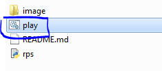
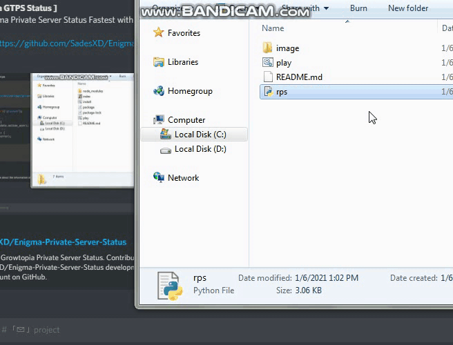

# Rock, Papper, Scissor Games

## Package required
- os
- random

## Usage
- 1. You need to install python first, docs -> [https://www.python.org/downloads/](https://www.python.org/downloads/), and then run the setup of python
- 2. You can also install this app, switch `code -> download zip` and extract the rar to file and move that's file to 1 folder or to your folder

- 3. If you done, you can just click the file called `play.bat`, or you can just click the file called `rps.py`, and now you can play the game

    

- 4. Enjoy 

## Picture

